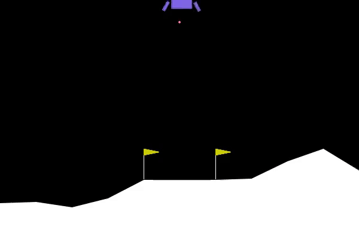
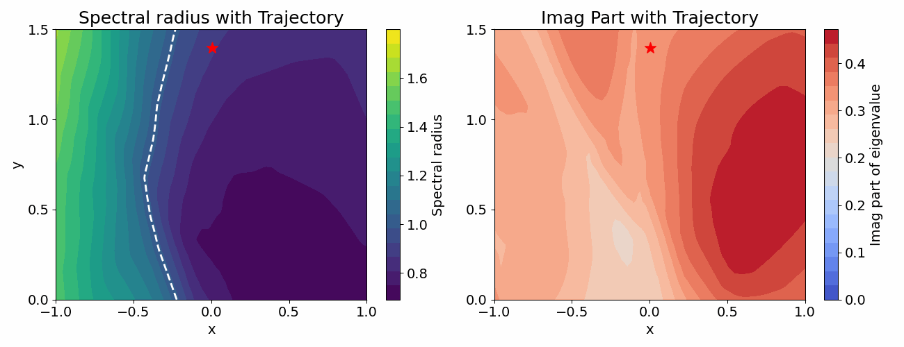
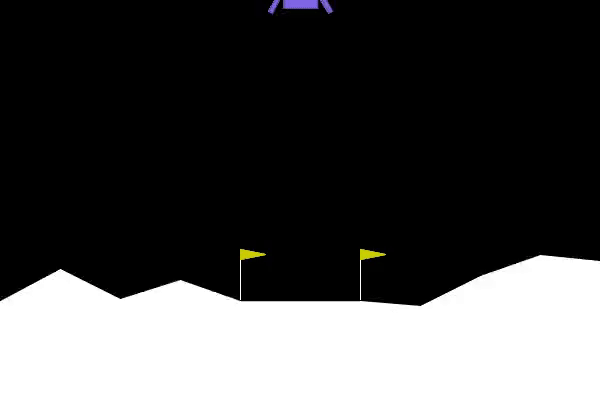
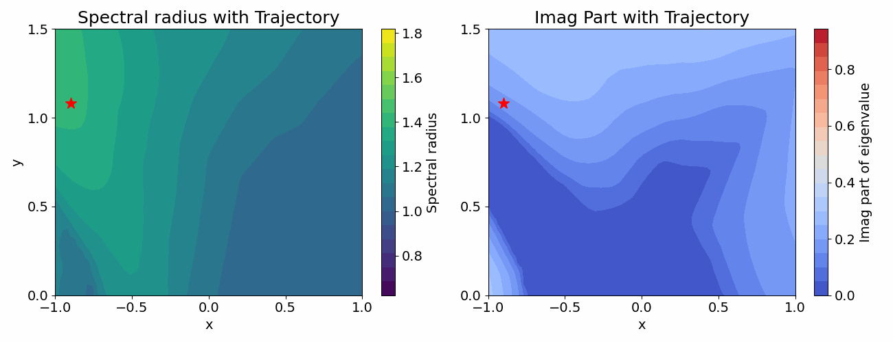
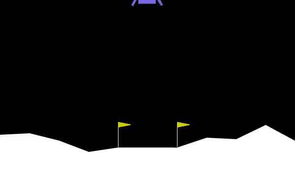
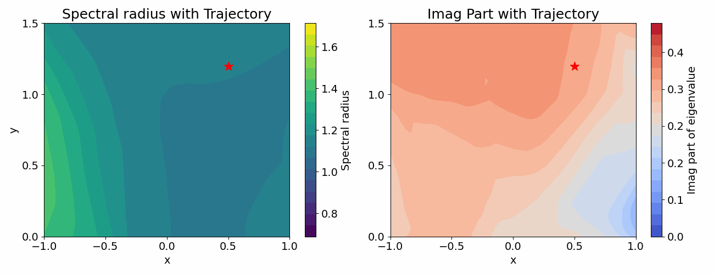
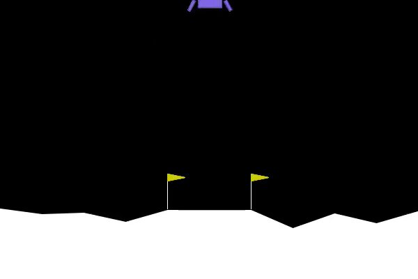
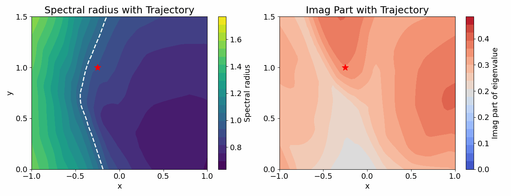

# SALSA-RL: Stability Analysis in the Latent Space of Actions for Reinforcement Learning [[arXiv]](https://arxiv.org/abs/2502.15512)

```BibTex
@article{li2025salsa,
  title={SALSA-RL: Stability Analysis in the Latent Space of Actions for Reinforcement Learning},
  author={Li, Xuyang and Maulik, Romit},
  journal={arXiv preprint arXiv:2502.15512},
  year={2025}
}
```

## Overview
SALSA-RL is a reinforcement learning framework that non-invasively analyzes local stability in the latent action space. By modeling actions as time-varying linear dynamics, it applies control-theoretic tools, such as spectral radius, transient growth, and Floquet analysis, for stability analysis. SALSA-RL enables interpretation of pretrained agents, early warning of control failures, and insight into policy behavior without modifying the policy or training process, and with no loss in performance.


## Local stability animations for LunarLander (hovering objective)

White line: spectral radius = 1

Red line: agent trajectory

### Case 1

<table>
<tr>
  <td></td>
  <td></td>
</tr>
</table>

### Case 2

<table>
<tr>
  <td></td>
  <td></td>
</tr>
</table>

### Case 3

<table>
<tr>
  <td></td>
  <td></td>
</tr>
</table>

### Case 4

<table>
<tr>
  <td></td>
  <td></td>
</tr>
</table>


